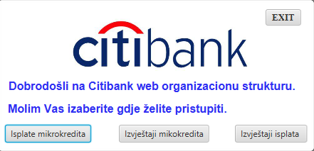
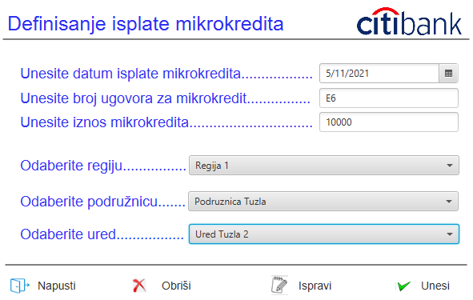
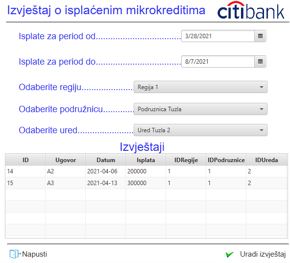
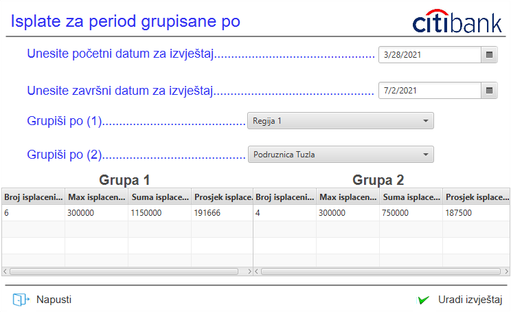

# Bank_test_project

Application where user can input, edit or remove clients for a loan into a database. Application also showcase loan reports in two ways:

* Clients contract, date of a contract including value of a loan and when was that loan given depending of a user's date range and certain office where the contract was given.

* Number of contracts, maximum, average and sum of a loans depending of a user's date range and certain office where the contract was given.

# Preview        

  
   

  
   

